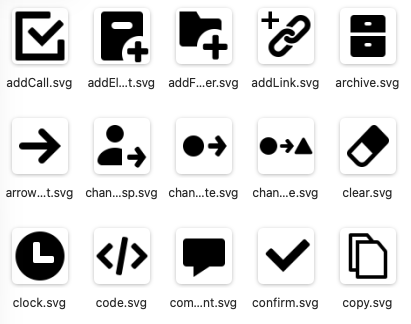

# nsmp-icons



Набор SVG-иконок для NSMP-приложений.

## Установка

```bash
npm install nsmp-icons
```

## Использование

Иконки можно импортировать по именам одним named import. Сборщик включит в итоговый бандл только реально используемые иконки:

```js
import { AddCall, ZoomIn } from "nsmp-icons";

const addCallImage = document.createElement("img");
addCallImage.src = AddCall;
addCallImage.alt = "";

const zoomInImage = document.createElement("img");
zoomInImage.src = ZoomIn;
zoomInImage.alt = "";
```

Для Vue 3 доступны готовые компоненты через отдельный entrypoint:

```vue
<script setup>
import { AddCall, ZoomIn } from "nsmp-icons/vue";
</script>

<template>
	<AddCall class="icon" alt="Добавить вызов" />
	<ZoomIn width="20" height="20" />
</template>
```

Каждый компонент рендерит SVG как `img`, принимает стандартные HTML-атрибуты и импортируется отдельно, поэтому неиспользуемые иконки не попадают в bundle. Для этого варианта приложение должно использовать Vue 3.

При необходимости одну иконку можно импортировать напрямую по имени файла:

```js
import addCallUrl from "nsmp-icons/icons/AddCall.svg";

const image = document.createElement("img");
image.src = addCallUrl;
image.alt = "";
document.body.append(image);
```

Для HTML без JavaScript можно использовать URL пакета напрямую:

```html

```

В Vite, webpack и других сборщиках SVG также можно импортировать как исходный текст, если это поддерживает конфигурация проекта:

```js
import addCallSvg from "nsmp-icons/icons/AddCall.svg?raw";
```